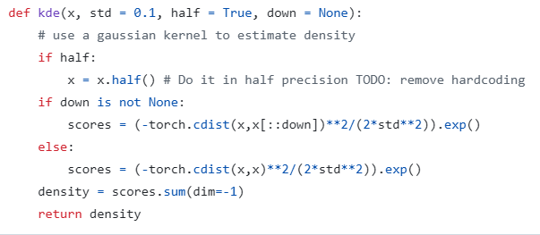

**Computer Vision SfM relative pose estimator – Guni Deyo Haness**

The process to reconstruct 3D objects and buildings from images is called Structure-from-Motion (SfM). Typically, these images are captured by skilled operators under controlled conditions, ensuring homogeneous, high-quality data. It is much more difficult to build 3D models from assorted images, given a wide variety of viewpoints, lighting and weather conditions, occlusions from people and vehicles, and even user-applied filters. The first part of the problem is to identify which parts of two images capture the same physical points of a scene, such as the corners of a window. This is typically achieved with local features (key locations in an image that can be reliably identified across different views). Local features contain short description vectors that capture the appearance around the point of interest. By comparing these descriptors, likely correspondences can be established between the pixel coordinates of image locations across two or more images. This “image registration” makes it possible to recover the 3D location of the point by triangulation.
Problem definition

The goal of the contest is to estimate the relative pose between two images. This requires some knowledge of projective and epipolar geometry, particularly with regards to the following:

• The calibration matrix K captures camera properties that determine the transformation between 3D points and 2D (pixel) coordinates. It is also known as the camera intrinsics.
• The rotation matrix R and the translation vector T capture the 6-degree-of-freedom pose (position and orientation) of the camera in a global reference frame. They are collectively known as the camera extrinsics.
• The fundamental matrix F encapsulates the projective geometry between two views of the same scene. It is not affected by the contents in the scene, and depends only on the intrinsics and extrinsics of the two cameras.
The training data provides K , R and T as ground truth. Participants are asked to estimate F. We explain these concepts in more detail below.
Projective geometry

In computer vision, the transformation between 3D (world) and 2D (image) is governed by projective geometry. We use the simplest camera model, that of the pinhole camera, which is illustrated below.

**Projective geometry**

In computer vision, the transformation between 3D (world) and 2D (image) is governed by projective geometry. We use the simplest camera model, that of the pinhole camera, which is illustrated below.

 

the projection of a 3D point in meters, into 2D coordinates, in pixels, can be simply written as
mi=KMi
where K is the calibration matrix.

**Epipolar geometry**

Epipolar geometry is the projective geometry between two views. It does not depend on the structure (contents) of the scene: it depends only on the relative pose (extrinsics) and the internal camera parameters (intrinsics).

In computer vision, this relationship is typically expressed as the fundamental matrix, a 3×3
matrix of rank 2. Given a 3D point Mi, in meters, and its projections on two different cameras mi and m′i, in pixels, the fundamental matrix for these two views F must satisfy
m'TiFmi=0.

I’ve tried assessing this problem in many ways which I will discuss here.

First, I tested the naive way implemented in the given Jupiter notebook – finding keypoints with SIFT and using OpenCV to predict the fundamental matrix (which uses MAGSAC). This method performed very poorly and I realized I have to figure out how to optimize both of the main fundamental components of the project – finding keypoints and F prediction with those keypoints. 

Regarding **F prediction**, at first, I wanted to find a method that can:

- Utilize training dataset
- Utilize deep learning

And so, I found [Deep Fundamental Matrix Estimation](https://vladlen.info/papers/deep-fundamental.pdf), which basically uses Deep Learning to find the best weights for weighted-least squares as part of finding F: 

This method requires us to create COLMAP databases from the training and testing datasets and even though this method was approved by Professor Egozi, using COLMAP wasn’t approved by him so I realized I can’t actually use this method. It doesn’t matter that much because I was surprised to find out that the performance of DFE was similar to the standard RANSAC method by OpenCV. Then I focused on optimizing the OpenCV parameters for finding the F matrix (parameters for cv2.findFundamentalMat). At first, I tested many variations of RANSAC and found out that MAGSAC works the best, even better than USAC\_ACCURATE in about 2 percent of accuracy (mAA) which should be more accurate and also takes about twice the computation time and resources. [MAGSAC](https://openaccess.thecvf.com/content_CVPR_2020/papers/Barath_MAGSAC_a_Fast_Reliable_and_Accurate_Robust_Estimator_CVPR_2020_paper.pdf) improves upon RANSAC by replacing the fixed inlier threshold with a probabilistic model scoring approach, making it more adaptive to noise and outliers. Instead of a binary inlier classification, MAGSAC assigns a soft inlier probability, leading to better robustness. It also optimizes model selection using a marginalized likelihood estimation, reducing reliance on manual threshold tuning. Additionally, MAGSAC is more computationally efficient due to its progressive model estimation, achieving higher accuracy with fewer iterations. Overall, it enhances robustness, accuracy, and efficiency compared to traditional RANSAC. Considering maxIters and confidence parameters, I found 10000 and 0.999999 (respectively) to work the best when considering the balance between accuracy and performance. I’ve also tested many different values for ransacReprojThreshold and found 0.7 to work the best. The usual value is 0.2 thus having a high threshold compared to the default means that the MAGSAC is much looser while accepting more inliers which can all reduce accuracy. However, I found that increasing it actually produces better accuracy. It must have to do with the accuracy & robustness trade-off – with a lower threshold that are fewer inliers and only very accurate correspondences are considered (works well for clean data with minimal noise), with a higher threshold more correspondences are considered, making the algorithm robust to noise but increasing the possibility to reduce accuracy. In my case, where increasing it actually improved the accuracy, it might be due to several reasons:

- Noisy data with good matches – imperfect feature detection and/or camera noise might lead to good correspondences with slight localization errors which can occur due to the images being from significantly different viewpoints of the object. Although these keypoints might still be relatively close to the correct epipolar geometry (have small reprojection errors but aren’t perfect matches). A higher threshold allows more of these correct (but slightly off) matches to be considered inliers.
- Motion blur/lens distortion – image features are affected by many factors such as motion blur, distortion, rolling shutter effect and more. A strict (lower) threshold may reject too many inliers.

To sum up the part of F prediction (given keypoints that where already detected and matched), here are the parameters: 

Now let’s consider the other significant part of this project which is **detecting and matching keypoints** in the pairs of images which is necessary for MAGSAC to estimate F.

As I already mentioned, the classic way of SIFT doesn’t perform well at all for this dataset. Let me explain how it works: SIFT applies a Gaussian blurring filter to the image at multiple scales and octaves (in each octave all the images have the same scale but different std value for the Gaussian filter). Then it subtracts adjacent pairs in each octave to detect edges and corners efficiently, this process is called DoG (difference of Gaussian) which provides an appropriate approximation to LoG (Laplacian of Gaussian) which is less efficient to calculate. After computing the DoG, SIFT finds extrema points by checking if a pixel is a local maximum or minimum compared to its 26 neighbors in the current and adjacent neighbors (8 in the current one, and 9 at the 2 adjacent neighbors). These extrema represent keypoints which are scale-invariant. Then it creates a descriptor for each keypoint by dividing each image scale into a 4x4 grid and for each cell an 8-bin histogram of gradient orientations is computed (4x4x8=128 values). Matching is done by checking the Euclidean distance between their descriptors while also considering Lowe’s Ratio Test – keep a match only if the best match is significantly closer than the second-best match. This way SIFT eliminates false matches by ensuring each of them is unique enough. 

After testing SIFT, I realized I should implement Deep Learning in this part, as I already knew CNN can work very well with keypoint detection, and we already saw that Deep Learning didn’t perform so well in estimating F given the matched keypoints. I’ve tested many different varieties and compared their performance and accuracy, including DKM, LoFTR, SuperPoint+SuperGlue. I found DKM to be too computationally demanding. Then I found [RoMa](https://arxiv.org/pdf/2305.15404) which was more accurate and performed better on our dataset than all the others, which is not surprising considering these benchmarks:

I’ll explain the logic behind this model. RoMa is a detector-free feature matching approach that estimates dense correspondences between two images instead of detecting and matching explicit keypoints (as done in traditional methods like SIFT). It performs Coarse features (such as object shapes and textures) extraction with DINOv2 which is a self-supervised pre-trained Transformer model which captures high level structures and semantic relationships in an image. Furthermore, it performs Fine features (such as edges and corners) extraction which refines those coarse features with CNN (such as VGG) which is also pretrained. The combination of DINOv2 (coarse) and ConvNet(fine) results in a hierarchical feature pyramid. Now let’s talk about matching the features between the Images. As I already mentioned, RoMa is a “detector-free feature matching” model.  Once RoMa extracts features from both images, it estimates correspondences using a pretrained Transformer based decoder. RoMa's Transformer learns spatial relationships across different image regions. It assigns attention weights to different pixels, ensuring that important areas receive more focus while ignoring background noise. The output of the Transformer is a set of coarse correspondences between the two images. After predicting correspondences, RoMa constructs a dense warp field called **W\_A->B** which is basically a pixel transformation map that specifies where each pixel in image A corresponds to a pixel in image B. This dense mapping allows the model to track how image structures transform (shift, rotate, deform etc.) Now, RoMa filters and samples the most reliable matches. This step is done by the sample function (which is the part of the Regression model in RoMa) whose goal is to extract a sparse set of ‘num’ high quality matches based on certainty scores that will be used for MAGSAC to estimate F (in our case). Here is the warp field creation and sampling of high confidence matching in code: 

The sample\_thresh parameter defines the confidence threshold – only matches with a certainty score above this value are prioritized:

This prevents overconfident low-quality matches from dominating the selection process. Also, KDE **(Kernel Density Estimation)** is used to ensure an even spatial distribution of matches rather than being clustered in dense regions:

On top of that, it uses **“symmetric matching”**. Given a pair of matched features x and x’ in 2 images A and B respectively, the confidence in the wrap field of A that x corrospondes with x’ doesn’t usually equal to the confidence in the wrap field of B that x’ corrospondes with x. Therefore, it creates symmetric wraps by creating **W\_A->B** and **W\_B->A**, then it filters out inconsistent matches that don’t mutually agree:

At first while using RoMa normally by importing roma\_outdoor model I got great results but I wanted to optimize every parameter of it. And so, I modified the source code of RoMa from [GitHub](https://github.com/Parskatt/RoMa) in many different ways to get the best result. At first, as I mentioned RoMa’s DINOv2, CNN and Transformer matcher are all pretrained. So, the first thing that came to my mind is training RoMa on my data, which I did (in addition to fine tuning of other parameters that I’ll soon discuss) and got great results:

But actually, my best result was with using RoMa with its pretrained parameters: 

Therefore, I removed the training part of my code from the Jupiter Notebook but I’ll show it here (Thus it’s unnecessary to submit the RoMa weights file but the code still saves it): 

But as I mentioned, testing with the pre-trained parameters has provided me with the best accuracy which makes sense after all because DINOv2 was pretrained by META and the VGG was pretrained on ImageNet. Now let’s talk about my source code modifications that have improved the accuracy. At first, I tried increasing the coarse and upscale resolutions with many combinations, hoping the matching will be more accurate and provide better accuracy, but actually the accuracy was a bit worse and performance-wise, it was very slow and computationally demanding, so I figured I should use the default values which were probably wisely chosen while validating the model over various datasets. I also tried increasing the parameter num for sample function in the source code so MAGSAC can have more data, but it was also too slow and didn’t provide better results. **But** the change which as provided me with the improvement was changing sample\_thresh. The value for it in the source code is 0.5 but I found 2.5 to work the best. Compared to the MAGSAC threshold where lower value means stricter behavior, here it’s the opposite. The higher the value the more confident a match must be to be included. In my case, a higher threshold works better which makes sense because it only picks the most reliable correspondences which can help the model to be more robust with noisy data. This helps MAGSAC because it starts with better quality correspondences where’s MAGSAC’s threshold is like a second security check to refine those sets of matched keypoints and return the F model which has the most inliers. After fine-tuning all of those, I improved the accuracy at about 2 percent from the standard RoMa model:

To

In addition to improving the accuracy I also attempted **improving the performance of the RoMa** model. Looking at the kde part in the sample function which I’ve mentioned above, I dived into the source code and saw that the function implementing kde can be improved: 

Instead of calling torch.cdist, we can compute the squared norms and use the identity:

||xi-xj||^2 = ||xi||^2 + ||xj||^2 – 2(xi\*xj) 

We can use matrix multiplications and tensor broadcasing to implement it, which are both operations highly optimized on GPU. They do take extra space in memory but I noticed it isn’t significant at all. I also tried dividing the matches into batches and compute each batch separately in parallel to other via multiple CUDA streams, but it turned out that vectorization on the whole batch is faster.

Here is the code that you need to add to the source code of the regression model in RoMa:

Update sample function accordingly: 

And performance is improved!

**Normal kde time: 0.004115581512451172**

**Fast kde time:       0.0016169548034667969**

<b>Finally</b>, as I showed 2 pages ago my best result was <b>69.266</b> percent accuracy (mAA), which places me in the <b>3rd</b> place overall (Only in terms of accuracy, as I have also improved performance but Kaggle doesn’t check that). 

**Best regards,**

Guni
